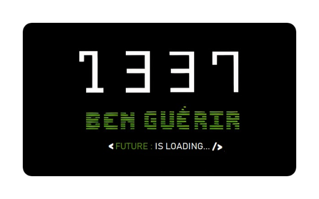

   
  <h2 align="center"> 

 </h2>

<h2 align="center">A student at:     
  
</h2>

  <!---  
  <h2 align="center">A student at :   
  <h3 align="center">  from :   </h2>
   
  --->
---
  <!---
  <h2 align="center"></h2>
  --->
   

  <h2 align="center" font-family="Gugi">
	  
  - `🔭` I’m currently working on my `42Cursus`

  &nbsp;&nbsp;&nbsp;&nbsp;&nbsp;&nbsp;   
  
  - `🌱` I’m currently learning:  
 
  `42Cursus`   <a href="https://linuxcommand.org/lc3_lts0010.php" target="_blank">  

<!--
` Desktop Development Application & Mobile Development Application `    
--->

 ` Web Developement `        

 

  - `😊`  I’m extremely interested in :     
  
 

  - `😄` Let me know if u guessed the meanin' of : `imdstl`

 

  - `💼` My Portfolio : **https://ababdelo.github.io/portfolio/**

 

  - `📫` How to reach me : **ababdelo@student.1337.ma**

 

</h2>

---

 

	

 <h2 font-family="Gugi"> Click to see my   Chart Details</h2>

 

<!-- <br/ -->

<table align="center">
  <tr>
    <td align="center"></td>
    <td align="center"></td>
  </tr>
  <tr>
    <td colspan="2" align="center"></td>
  </tr>
</table>

 
  

  

	
	
	

---

 

|                                                        
 `Contribution Graph` 
                                                    |
| :--------------------------------------------------------------------------------------------------------------------------------------------------: |
|   &nbsp;&nbsp;&nbsp;&nbsp;&nbsp; &nbsp;&nbsp;&nbsp;&nbsp;&nbsp;     |

---

<h4 align="center">Buy me a </h4>

### Or Show some  by  some of the repositories!

---
